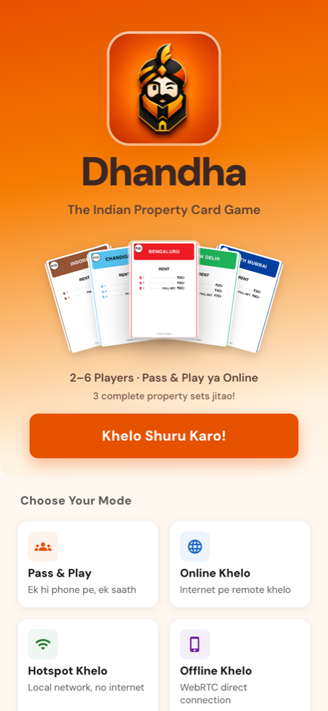
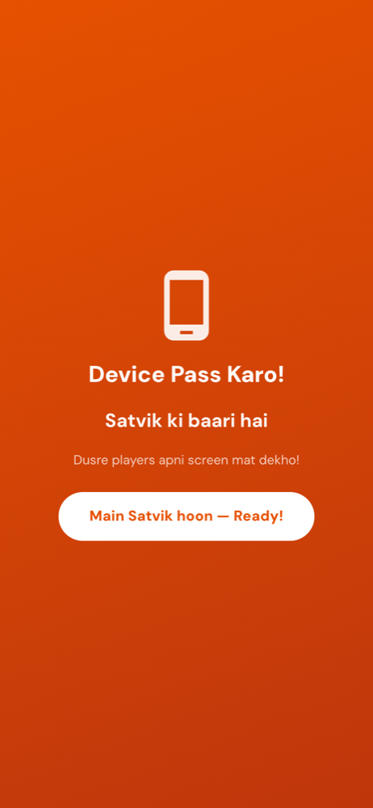
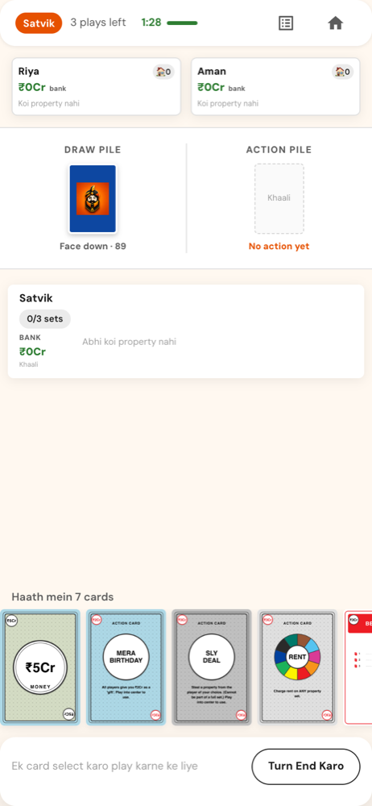

<div align="center">

# 🏠 Dhandha — The Indian Property Card Game

**Monopoly Deal, made Indian.** Buy Bengaluru, charge rent on South Mumbai, steal your friend's Indore. On one phone, over hotspot, or online.

[](https://satvik-jain-iitd.github.io/dhandha/)
[](https://satvik-jain-iitd.github.io/dhandha/)

&nbsp;&nbsp;
&nbsp;&nbsp;


<sub>Home screen · "Device Pass Karo!" between turns · a turn in progress</sub>

</div>

---

## 🏔️ The Story Behind Dhandha

It started on a trip to **Manali** with friends. We had a deck of Monopoly Deal cards — that fast, chaotic card game where you buy properties, charge rent, and steal from each other. Perfect for long bus rides and cold evenings.

But Manali had other plans.

The wind would scatter the cards. Cafés had tiny tables. The bus was too bumpy. We'd set up a game, get halfway through, and have to pack up because the driver was leaving or the chai shop was closing. We tried existing digital versions, but they were **full of bugs** — Android and iOS apps that couldn't play together, games that froze mid-turn, features that just didn't work.

So I built my own.

**Dhandha** is a full digital adaptation of Monopoly Deal — reimagined with Indian cities and built as a Progressive Web App so it works on any phone, anywhere, even offline. No app store. No signup. No backend. Just open the link and play.

---

## 👋 For Players

### What is Dhandha?

A fast-paced property card game for **2–5 players**. Buy properties from Indian cities (Indore, Bengaluru, South Mumbai, Lutyens Delhi), charge rent, steal complete sets, and be the first to complete 3 full property sets.

The UI speaks Hinglish, the cards feature Indian landmarks, and two custom cards — **Sabotage** (force a trade between opponents) and **Insurance** (block a Deal Breaker) — add twists you won't find in the original game.

### How to Play (60 seconds)

| Step | Action |
|------|--------|
| **1** | Draw 2 cards — har turn mein |
| **2** | Play up to 3 cards — property, money, ya action khelo |
| **3** | Build sets — ek hi colour ki 2-4 properties ikatthi karo |
| **4** | **Win** — sabse pehle 3 complete sets, you win! 🏆 |

### 4 Ways to Play with Friends

| Mode | How it works |
|------|-------------|
| 📱 **Pass & Play** | Ek hi phone pe sab saath — pass the phone around |
| 🌐 **Online Khelo** | Internet ke saath remote players se khelo |
| 📡 **Hotspot Khelo** | Local network mein, kisi bhi jagah |
| 📵 **Offline Khelo** | WebRTC direct connection — bus ya train mein bhi |

No accounts. No ads. No data collection. Open the link and play.

---

## 🧠 What Went Into Building It

This was a solo project — every line of code, every design decision, every bug fix. Here's what I focused on:

### Engineering decisions I'm proud of

**State machine as a pure reducer.** All game state lives in a single `useReducer` with a deterministic phase enum. Every action deep-clones state and returns a clean next state — no side effects, no surprises. Illegal moves are blocked at 3 layers (UI, action creator, reducer) so no code path can reach an invalid state.

**Multiplayer that actually works.** WebRTC for peer-to-peer sync, WebSocket for signalling, a message queue that eliminated a fragile setTimeout race, and exponential backoff reconnection. The Android-iOS cross-play bug that frustrated me in other apps? Solved here — same codebase, same experience.

**Mobile-first, truly.** 375×667 baseline, consistent spatial system, animated transitions, tactile sound feedback, PWA with full offline support. It's meant to be played anywhere — on a bus, in a café, on a mountain.

**Process matters.** I set up a 3-agent AI review pipeline (Tech Lead → SDE → QA) with explicit UAT checklists and a headless simulation runner that replays entire games for debugging. Every bug fix is verified against structured pass/fail criteria before shipping.

### Tech stack

React 19, Vite 8, Material UI v9, WebRTC + WebSocket, Cloudflare Workers (signalling relay). Zero backend. No database. No auth.

### Key numbers

- **110 cards** in the deck (28 properties, 34 actions, 20 money, 13 rent, 11 wild, 4 custom)
- **12 game phases** through a single reducer — zero known state bugs
- **4 game modes** — pass-and-play, online, hotspot, offline
- **40+ action types** in the state machine

---

## 🚀 Try It

```bash
git clone https://github.com/satvik-jain-iitd/dhandha.git
cd dhandha
npm install
npm run dev
```

Open `http://localhost:5173`. Or just open the [live demo](https://satvik-jain-iitd.github.io/dhandha/) — it's a PWA, installable on any device.

```bash
npm run build      # Production build
npm run preview    # Serve production build locally
```

---

<div align="center">

Built by [Satvik Jain](https://github.com/satvik-jain-iitd)

</div>
